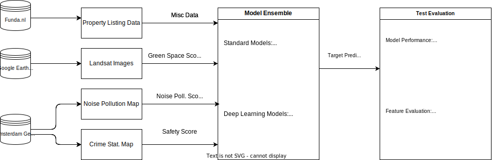
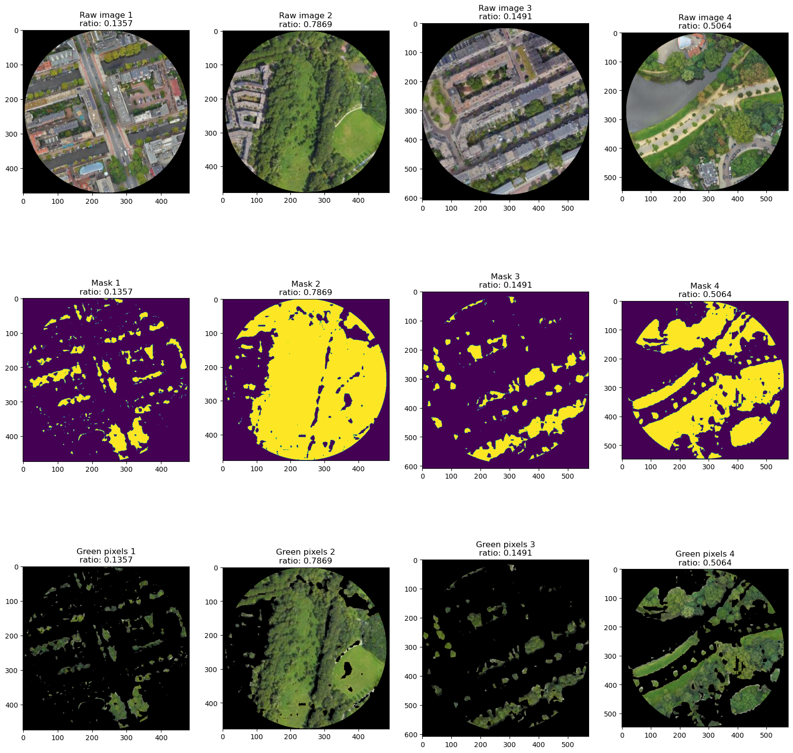

# Forecasting Real Estate Prices using Big Data: Methods and Alternative Data Sources

## Description

This project is meant to analyze the use of alternative data sources such as satellite imaging, geocoding, green space, noise and safety approximation to build large scale hedonic ML models for Real Estate valuation.

## Acknowledgement

This GitHub repository is only a guide to my BSc Thesis in Machine Learning and serves no other purpose than to showcase my findings in this project. I derive no rights from the usage of data and pre-existing models and all findings have only strictly theoretical implications. 

## Project Plan 

Below is a flowchart of the proposed framework:

## Data

### Data Availability

| Data type | Data source | Transformation methods | Condensed Data | Level of data |
|:---|:---|:---|:---|:---|
|Property Sales Data|Funda.nl (via funda scraper)| Label encoding, standardizing| 25 unique data-points| Individual points | 
| Green Space Nearby | Google Earth Engine (Sentinel-2 RGB) | Masking, green-pixel/total pixels ratio| Green Space Prevalence Score | ~Individual points |
| Noise Pollution Prevalence Score | Amsterdam Gementee Noise Pollution Map | Masking, pixel prevalence ratio | Noise Pollution Prevalence  | ~Block level  | 
| Neighborhood Safety Score | Amsterdam Gementee Neighborhood Safety Score | Standardizing | Range (0-1) 1: Safest 0: Least Safe|
| RE related search terms  | Google Trends API | Avg. scoring of prevalence during period | Range (0-1)   1: Highest interest  0: Lowest interest| City level |  
| Listing description | Funda.nl (via funda scraper) | Sentiment Analysis with continuos output| Score (0-1)  1: Highest Price Listing  0: Lowest Price Listing| Individual points | 

### Data usage

#### Green Space Estimation

Green space estimation happens by obtaining landsat images from Google Earth's API for each geolocation. Then, a circular clipping mask of  radius $r$ is applied. Within the circle, each pixel is counted, and we obtain the ratio by dividing pixels falling in the green range with overall pixels within the area of the circle.

#### Noise Pollution Score

There are readily available noise pollution maps both on a city and regional level for the Netherlands. A similar scoring system as the Green Space estimation can be utilized to see the exposure to noise of an apartment.

#### Distance to Centre Score

Distance to centre score is calculated by taking a cluster (city) of data points, distributed by x,y coordinates, and locating the centroid of the cluster, calculating Eucledian distance from point to centroid. This method of calculation relies on an important assumption:
The sample is representative of the population and functional city centres can be located by apartment density.

#### Google Trends Score

Google Trends gives a very high level summary of search term usage. In the Netherlands, regional levels of search analytics can be accessed.
**This score can be only implemented if the final sample will be on a regional level, not on a city level.**

#### Neighborhood Safety Score

Amsterdam provides a district level breakdown of safety scores.

### References

Ho, W. K., Tang, B., & Wong, S. K. (2021). Predicting property prices with machine learning algorithms. Journal of Property Research, 38(1), 48–70. https://doi.org/10.1080/09599916.2020.1832558

Lorenz, F., Willwersch, J., Cajias, M., & Fuerst, F. (2022). Interpretable machine learning for real estate market analysis. Real Estate Economics. https://doi.org/10.1111/1540-6229.12397

Pérez-Rave, J., Correa, J. C., & Echavarría, F. G. (2019). A machine learning approach to big data regression analysis of real estate prices for inferential and predictive purposes. Journal of Property Research, 36(1), 59–96. https://doi.org/10.1080/09599916.2019.1587489

Valier, A. (2020). Who performs better? AVMs vs hedonic models. Journal of Property Investment & Finance, 38(3), 213–225. https://doi.org/10.1108/jpif-12-2019-0157

W. (n.d.). GitHub - whchien/funda-scraper: FundaScaper scrapes data from Funda, the Dutch housing website. You can find listings from house-buyer or rental market, and historical data. GitHub. https://github.com/whchien/funda-scraper